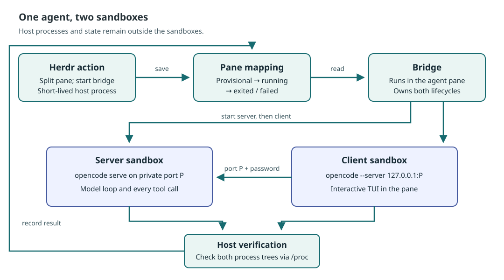

# herdr-nono-plugin

**Documentation: <https://schemaitat.github.io/herdr-nono-plugin/>**

[](https://herdr.dev/plugins)
[](https://herdr.dev/docs/plugins/)

[](LICENSE)

A [Herdr](https://herdr.dev) plugin that runs [OpenCode](https://opencode.ai)
inside [nono](https://nono.sh) sandboxes, one agent per pane.

> **OpenCode first.** The plugin is built and tested for OpenCode 2.x: its
> sandbox layout, profiles and verification follow OpenCode's client/server
> split. Other agents can be configured as [custom agents](docs/configuration.md#custom-agents),
> but they run in a single sandbox and are untested.

## Get started

### 1. Install

Needs Linux (kernel 6.7+), [Herdr](https://herdr.dev) 0.9+, [nono](https://nono.sh)
0.78+ and [OpenCode](https://opencode.ai) 2.x signed in to a provider. Nothing else runs at runtime: the
plugin is one binary (no Node.js).

```bash
nono pull nolabs-ai/opencode                                          # the nono profile pack the plugin builds on
herdr plugin install schemaitat/herdr-nono-plugin
herdr plugin action invoke doctor --plugin nono.sandbox               # checks nono and tries to escape a test sandbox
herdr plugin action invoke install-keybindings --plugin nono.sandbox  # adds the chords below
```

Herdr's install runs `scripts/install-binary.sh`, which downloads the release binary for your machine
(x86_64 or aarch64 Linux), checks its sha256 and installs it as `bin/herdr-nono`. If there is no
release for that version yet, or no network, it builds from source instead, which needs
[Rust](https://rustup.rs) (`cargo`). To retry, run `sh scripts/install-binary.sh` in the plugin
directory; see [Getting started](docs/getting-started.md#install) for the details.

### 2. Start an agent

Open Herdr in a project, focus a pane and press **`prefix+shift+a`**
(`prefix` is `ctrl+b` by default). A new pane opens with the OpenCode TUI.
Press **`prefix+shift+o`** to see the agent's client and server sandboxes and
every process running in them. After quitting OpenCode, **`prefix+shift+b`**
resumes the conversation.

### 3. Check the profiles

The sandbox policy lives in two nono profiles, one per sandbox. To see which
ones are active, where their files are and what they allow:

- In Herdr: **`prefix+shift+o`**, then **`i`** for the profiles view.
- `doctor` prints the plugin root (the shipped profiles are in its
  `profiles/`), the config directory and one line per resolved profile.
- `nono profile list` lists every profile nono knows by name, user profiles
  in `~/.config/nono/profiles/`; `nono profile show <name|path>` prints one
  fully resolved.

To change or extend them, see [Profiles](docs/profiles.md).

### 4. What the sandbox allows by default

OpenCode runs every tool call in its server, not in the TUI, so each agent
gets two sandboxes: a **server sandbox** (OpenCode's private server and every
tool it runs) and a **client sandbox** (the TUI).



| | Server sandbox: server and tools | Client sandbox: TUI |
| --- | --- | --- |
| Project files | Read-write: the worktree or git repository of the focused pane | Same |
| Rest of the filesystem | Only what OpenCode needs (its config and state, toolchains, `/tmp`); not your home directory, not `~/.ssh` | Same |
| Internet | HTTP(S) to GitHub Copilot and OpenCode's model catalog only, through nono's proxy | None |
| Localhost | None, so not the unsandboxed OpenCode service on `:4096`; only its own port for the client | Only its server's port |
| SSH, databases, UDP | Blocked; use HTTPS git remotes | Blocked |
| Herdr, systemd, D-Bus, SSH and GPG agents, clipboard | Blocked | Blocked |

After each launch the plugin checks from outside, through `/proc`, that every
process is confined and that the TUI talks to its own sandboxed server. If
either check fails, it stops the agent. To change these defaults, see
[Profiles](docs/profiles.md); for what the sandbox does not cover (your
workspace, shared OpenCode config), see [Security](docs/security.md).

#### Why sockets are blocked

Herdr, systemd, D-Bus, the SSH and GPG agents and Docker all take requests
over a Unix socket, a file such as `~/.config/herdr/herdr.sock`. A process
that can connect to one can ask that service to act for it, outside the
sandbox: through Herdr's socket, `herdr pane run <pane> <command>` runs any
command in a real, unsandboxed pane.

File permissions alone cannot stop this. nono grants directories, and the
sandbox may write `/tmp` and your workspace, so it could reach any socket in
them. Both shipped profiles therefore set
`"linux": { "af_unix_mediation": "pathname" }`. With it, nono's supervisor,
which runs outside the sandbox, checks every `connect()` and `bind()` on a
Unix socket and refuses each one the profile does not list under
`filesystem.unix_socket`. The socket file stays visible, but connecting fails
with `Operation not permitted`, so `herdr pane run` fails before Herdr
receives anything. Without the setting, the same command reaches Herdr.

Keep this setting in every profile you write. To let the agent use one
socket, list it under `filesystem.unix_socket` instead of removing the
setting. `doctor` and `test/integration-sandbox.test.mjs` check it; details in
[Security](docs/security.md#why-herdr-pane-run-cannot-reach-the-host).

## Key bindings

| Chord | Action | Does |
| --- | --- | --- |
| `prefix+shift+a` | `start-agent` | Start OpenCode in a new pane, server and client sandboxed |
| `prefix+shift+o` | `sandboxes` | Open the [sandboxes overlay](docs/overlay.md): every agent, its client and server sandbox, their processes; `enter` shows an agent's details, `g` jumps to its pane, `a` cleans up all, `?` lists the keys |
| `prefix+shift+b` | `reconnect` | Resume the conversation in fresh sandboxes |
| `prefix+shift+s` | `open-shell` | Open a shell under the server's policy, the one the tools run under |

## Documentation

- [Getting started](docs/getting-started.md) · [Key bindings](docs/key-bindings.md) ·
  [Sandboxes overlay](docs/overlay.md) · [Working with agents](docs/agents.md)
- [Profiles](docs/profiles.md): see the active profiles, change them, or extend them with your own
- [Security](docs/security.md): what the sandboxes stop for OpenCode, and what they do not
- [Configuration](docs/configuration.md) · [Actions and scripting](docs/actions.md) ·
  [Troubleshooting](docs/troubleshooting.md)
- [Design](docs/design.md) · [Development](docs/development.md) · [Changelog](CHANGELOG.md)

## Status

Version `0.1.0`. Verified with Herdr 0.9.1, nono 0.78.0 and OpenCode 2.0.22 on
Linux 7.0. Not verified on a real host: the `worktree.removed` hook, custom
agents, macOS (not declared in the manifest).

## License

Apache-2.0. See [LICENSE](LICENSE) and [NOTICE](NOTICE). Structure and much of
the plumbing are adapted from
[herdr-sbx-plugin](https://github.com/dirien/herdr-sbx-plugin), the Docker
Sandboxes counterpart, whose action names, key bindings and result line this
plugin keeps.
