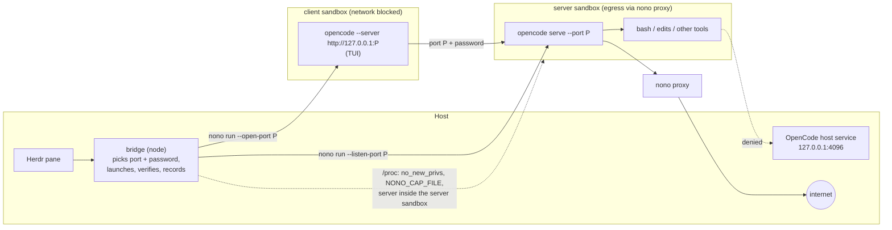

# herdr-nono-plugin

One coding agent per pane, its client and its server in [nono](https://nono.sh) sandboxes, driven from Herdr.

[](https://herdr.dev/plugins)
[](https://herdr.dev/docs/plugins/)

[](LICENSE)

This [Herdr](https://herdr.dev) plugin runs OpenCode inside
[nono](https://nono.sh) sandboxes (Landlock and seccomp on Linux) and gives it a
Herdr pane. Herdr keeps its status detection and key bindings, nono does the
confinement, and the plugin is the thin layer between the two. It is the nono
counterpart of [herdr-sbx-plugin](https://github.com/dirien/herdr-sbx-plugin),
which does the same with Docker Sandboxes, and keeps its action names, key
bindings and result line.

OpenCode 2.x is a client and a server, and the server runs the model loop and
every tool call. Plain `opencode` talks to a background service on the host,
so the tools would run outside any sandbox even with the client inside one.
The plugin therefore starts a **private server per pane in its own sandbox**
and the **TUI client in a second sandbox**, joined by one localhost port it
picks and a password it generates for each launch:

- The server sandbox reaches the internet only through nono's proxy (every
  domain allowed), so proxy-aware tools (`curl`, `git` over HTTPS, `npm`,
  `pip`, the model API) work, while direct TCP connects, including to services
  on localhost such as the OpenCode host service on `127.0.0.1:4096`, are
  denied.
- The client sandbox has no network at all except its server's port.
- Both block Herdr's control socket, the systemd and D-Bus sockets and the SSH
  and GPG agents.

After every launch the plugin checks from outside, by walking both sandboxes'
process trees, that every process is confined and that the server is the one
it started, and stops the agent when not.

> **Boundary:** Linux, with `nono` 0.78 or newer and the `nolabs-ai/opencode`
> pack. Verified with Herdr 0.9.1, nono 0.78.0 and OpenCode 2.0.20 on Linux
> 7.0. **Known limitation:** nono 0.78 rate-limits the connection checks it
> makes in proxy mode when AF_UNIX mediation is on. Roughly ten back-to-back
> connections from the server sandbox go through, further ones are denied
> until the burst subsides, so bursts of downloads (`npm install`) are slowed
> by retries and a single request can fail with "could not connect to proxy".
> Spacing requests by 0.1 s avoids it. See
> [docs/security.md](docs/security.md#nono-rate-limits-connections-in-proxy-mode).
> macOS is untested and not declared in the manifest.



## Requirements

| | |
| --- | --- |
| [Herdr](https://herdr.dev) | 0.9.0 or newer (`min_herdr_version` in the manifest) |
| [nono](https://nono.sh) | 0.78 or newer, with the OpenCode pack: `nono pull nolabs-ai/opencode` |
| [OpenCode](https://opencode.ai) | 2.x on the `PATH` Herdr gives plugins, signed in to a provider |
| Node.js | 20 or newer; no dependencies to install, the only build step records where `node` lives |
| Platform | Linux with Landlock (kernel 6.7+ for the network rules nono uses) |

## Install

```bash
nono pull nolabs-ai/opencode                      # the OpenCode pack the profiles extend
herdr plugin install schemaitat/herdr-nono-plugin
```

Herdr clones the repository and runs the manifest's build step,
`scripts/write-node-path.sh`, which records where your `node` lives. Pass
`--yes` to skip the confirmation prompt.

Verify what got registered and that nono and the profiles work:

```bash
herdr plugin action list --plugin nono.sandbox          # twelve actions
herdr plugin action invoke doctor --plugin nono.sandbox
herdr plugin log list --plugin nono.sandbox --limit 1   # "ok":true in the first stdout line
```

For development, link a checkout instead. `herdr plugin link` does not run
the build step, so record the node path yourself; `scripts/run-action.sh`
then runs an action and waits for its result:

```bash
git clone https://github.com/schemaitat/herdr-nono-plugin.git
cd herdr-nono-plugin && sh scripts/write-node-path.sh
herdr plugin link "$PWD"
sh scripts/run-action.sh doctor
```

## First run

1. Run `doctor` (above). It resolves both profiles and runs an escape probe
   inside a throwaway sandbox with the server profile, the one the agent's
   tools run under. Expect every probe `ok`, including
   `opencodeServicePort: denied`, and a line saying whether an OpenCode host
   service runs and that it is not reachable from the agent's tools.

2. Add the key bindings. This appends four `[[keys.command]]` entries to
   Herdr's `config.toml` and reloads it, skipping entries that already exist:

   ```bash
   herdr plugin action invoke install-keybindings --plugin nono.sandbox
   ```

3. Open Herdr in a project and press `ctrl+b`, release, then `shift+a`. A pane
   named `nono opencode <id>` appears, the plugin starts the server sandbox
   (its output goes to a log file), nono prints the client's grants, and the
   OpenCode TUI starts. Herdr shows it as working, blocked or idle like any
   local agent. Within a second or two the plugin has verified both process
   trees; `info` or the overlay (`ctrl+b`, `shift+o`) shows the result.

4. When you leave OpenCode, the plugin stops its server and the pane shows the
   exit code. Press `ctrl+b`, `shift+b` in that pane to resume the same
   conversation with a fresh server (`--continue`), or `ctrl+b`, `shift+s` for
   a shell under the server's policy, the one the agent's tools run under.

## Actions

Every action is an entry point Herdr can bind or invoke;
`herdr plugin action invoke <action> --plugin nono.sandbox` runs one from any
host terminal, and `sh scripts/run-action.sh <action>` does the same and waits
for its result.

| Action | Context | What it does |
| --- | --- | --- |
| `doctor` | global, workspace, pane | Checks `nono --version`, resolves the client and server profiles, runs an escape probe inside a throwaway sandbox with the server profile, and reports whether an OpenCode host service runs and can be reached. Starts no agent. |
| `install-keybindings` | global, workspace, pane | Appends the four key bindings listed below to Herdr's `config.toml` when they are missing, then reloads the config. |
| `start-agent` | workspace, pane | Splits a pane, starts the agent's server sandbox and launches the client sandbox in the pane, with the worktree granted read-write to both. |
| `reconnect` | pane | Launches the mapped agent again in its pane, with a fresh server and the adapter's resume arguments (OpenCode: `--continue`). |
| `open-shell` | pane | Splits a pane below and opens a shell in a new nono sandbox with the server's profile (the tools' policy) and the workspace grant. |
| `stop` | pane | Stops the agent's client session (`nono stop`), waits for the pane to record the exit, and stops a server session that outlived its pane. |
| `info` | pane | Prints the mapping, the resolved agent and profile, the live nono sessions and the last verification. |
| `verify-sandbox` | pane | Verifies the running sandboxes now: every process confined, the agent's server inside the server sandbox, the client pointed at it, no connection to an unsandboxed host service. |
| `prune-mappings` | global, workspace, pane | Drops mappings whose pane is gone and whose agent and shells are not running. |
| `sandboxes` | global, workspace, pane | Opens the interactive overlay: every agent with its pane, sandboxes and verification, a details panel, and keys to verify, stop and prune (see below). |
| `list-sandboxes` | global, workspace, pane | Lists every mapping with its nono session state and verification. |
| `forget-mapping` | pane | Drops the focused pane's mapping. Refuses while its agent or a shell runs. |

Pane actions use the focused pane. When that pane has no mapping but the
workspace has exactly one, the plugin uses that one, so running an action from
the pane next to the agent works. When the mapped pane no longer exists, for
example after a Herdr restart, `reconnect` opens a new pane next to you and
moves the mapping there (`adoptedFrom` in the result). When a pane swallows
the typed command because it is not at a shell prompt, `reconnect` starts in
a fresh pane after four seconds instead (`movedTo`). `reconnect` and
`forget-mapping` refuse while the agent's bridge is alive or Herdr detects an
agent in the pane.

Compared with the Docker Sandboxes plugin, `fetch-changes`, `open-port` and
`replace-sandbox` are gone: a nono sandbox is a process, not a VM, so there is
no clone to fetch from, no port to publish (the agent shares the host's
network namespace) and nothing to delete. `verify-sandbox` is new.

## The overlay

`prefix+shift+o` (or the `sandboxes` action) opens a full-screen view of every
agent the plugin tracks. It refreshes every three seconds. For the selected
agent it draws the client and server sandboxes side by side, each titled with
its network policy (from the resolved profile) and listing its live processes
from `/proc`: the TUI in the client sandbox (cyan), the server and every tool
it runs in the server sandbox (magenta, tools in yellow), each marked `✔`
confined or `✖` not.

```text
 nono sandboxes                                                              1 agent · 1 running · 7:53:28 AM
┌─ Agents ───────────────────────────────────────────────────────────────────────────────────────────────────┐
│     PANE       SESSION        AGENT     STATE    NONO                VERIFIED  DIRECTORY                   │
│ ▶●  wQ:p2      …96db19cd2fd8  opencode  running  client+server       ✔ ok      ~/projects/app              │
└────────────────────────────────────────────────────────────────────────────────────────────────────────────┘
 client ──:46541──▶ server ──▶ nono proxy ──▶ internet  ✖ localhost ✖ Herdr ✖ systemd ✖ ssh-agent
┌─ client · no network but :46541 ────────────────────┐┌─ server · on :46541, proxy egress ──────────────────┐
│ ✔ 3243039 tui    opencode --server http://127.0.0.… ││ ✔ 3243022 server opencode serve --hostname 127.0.0… │
│                                                     ││ ✔ 3243410 tool   └ bash -c npm test                 │
│                                                     ││ ✔ 3243414 tool     └ vitest run                     │
└─────────────────────────────────────────────────────┘└─────────────────────────────────────────────────────┘
┌─ Details ──────────────────────────────────────────────────────────────────────────────────────────────────┐
│ Session     herdr-opencode-96db19cd2fd8                                                                    │
│ Pane        wQ:p2 (open)  workspace wQ                                                                     │
│ Profiles    client herdr-opencode-client · server herdr-opencode-server                                    │
│ Verified    confined: 4 processes, server pid 3243022 (7:53:20 AM)                                         │
└────────────────────────────────────────────────────────────────────────────────────────────────────────────┘
 ✔ verified: confined: 4 processes, server pid 3243022
 ↑↓/jk  select   v  verify   x  stop   p  prune   r  refresh   q  quit
```

On a short screen the details panel gives way to the sandboxes. A server
profile that leaves localhost reachable shows up in the server's title
(`OPEN egress + localhost`) and in the flow line.

| Key | Does |
| --- | --- |
| `↑` `↓` / `j` `k`, `PgUp` `PgDn` | Select an agent; the details panel follows |
| `v` | `verify-sandbox` for the selected agent; the result shows in the status line |
| `x` | `stop` the selected agent and its server, after a `y/N` confirmation |
| `p` | `prune-mappings`: forget every mapping whose pane is gone and that runs nothing (marked `✗` and counted as stale), after a `y/N` confirmation |
| `r` | Refresh now |
| `q`, `ctrl+c` | Close |

`●` is a running agent, `○` an idle mapping, `✖` a failed launch; a failed
launch's reason is in the details panel (`Last error`).

## Key bindings

Herdr has no menu for plugin actions; they run from a key binding or the CLI.
The `install-keybindings` action, or `scripts/install-keybindings.sh` from a
checkout, appends these entries to Herdr's `config.toml` and then runs
`herdr config check` and `herdr server reload-config`:

| Chord | Action |
| --- | --- |
| `prefix+shift+a` | `start-agent` |
| `prefix+shift+b` | `reconnect` |
| `prefix+shift+s` | `open-shell` |
| `prefix+shift+o` | `sandboxes` |

These are the chords the Docker Sandboxes plugin uses. With both plugins
installed, the second installer reports the taken chords instead of
replacing them; bind the other plugin's actions to free chords yourself. If
`herdr config check` rejects the result, the file is restored from a backup
and the action fails with `config`. `herdr config reset-keys` removes every
custom binding.

## Configuration

The config file is `config.json` in the directory printed by
`herdr plugin config-dir nono.sandbox`. The plugin rejects unknown keys, so a
typo fails loudly instead of silently using a default.

```json
{
  "agentArgs": { "opencode": ["--auto"] },
  "readPaths": ["/home/me/reference-docs"],
  "nonoArgs": ["--memory", "4G"]
}
```

| Key | Default | Meaning |
| --- | --- | --- |
| `agentKind` | `"opencode"` | Which adapter to launch. Custom kinds come from `customAgents`. |
| `agentArgs` | `{}` | Per-kind argument list that replaces the adapter's default arguments. Required arguments (OpenCode's `--server http://127.0.0.1:<port>`) always come first, and copies of them here are dropped. |
| `resumeArgs` | `{}` | Per-kind arguments `reconnect` adds, replacing the adapter's (OpenCode: `["--continue"]`). |
| `agentEnv` | `[]` | `KEY=VALUE` entries set in the agent's environment. Keep secrets out; see nono's credential proxy. |
| `customAgents` | `{}` | Extra adapters, see below. |
| `profile` | `null` | nono profile for the pane's sandbox (OpenCode's client): a name (`nono profile list`) or an absolute path. `null` uses the adapter's, for OpenCode [`profiles/herdr-opencode-client.json`](profiles/herdr-opencode-client.json). |
| `serverProfile` | `null` | nono profile for the server sandbox, where the agent's tools run. `null` uses the adapter's, for OpenCode [`profiles/herdr-opencode-server.json`](profiles/herdr-opencode-server.json). |
| `allowPaths` | `[]` | Extra absolute directories granted read-write (`--allow`). |
| `readPaths` | `[]` | Extra absolute directories granted read-only (`--read`). |
| `nonoArgs` | `[]` | Extra `nono run` flags placed before `--`, for example `["--memory", "4G"]` or `["--rollback"]`. |
| `nonoBin` | `null` | Path to the `nono` executable. Falls back to `HERDR_NONO_BIN`, then `nono` on `PATH`. |
| `silent` | `false` | Pass `--silent` so nono prints no banner or summary in the pane. |
| `shell` | `"bash"` | Shell `open-shell` starts (bash, zsh and fish are started without start-up files, which nono denies). |
| `paneDirection` | `"right"` | Where `start-agent` splits: `right` or `down`. |
| `paneRatio` | `0.5` | Split ratio between 0 and 1 for `start-agent`. |
| `openIn` | `"split"` | Where `start-agent` puts the agent: a `split` next to the focused pane, or a new `tab`. |
| `reportAgentStatus` | `true` | Announce agents without a `herdrDetectionKind` to Herdr through `pane report-agent` while they run. |
| `sessionNamePrefix` | `"herdr"` | Session names look like `<prefix>-<agentKind>-<12 hex chars>`; they show up in `nono ps`. |
| `cleanupOnWorktreeRemoved` | `true` | When Herdr removes a worktree, stop the agents working in it and forget their mappings. |
| `hostServiceCheck` | `"refuse"` | What to do when an unsandboxed OpenCode background service is running **and** the server profile lets the tools connect to localhost directly (it does not with the shipped profile): `refuse` (do not start the agent; a framed message in the pane, a toast, and `doctor` fails), `warn` (start anyway with a pane line and a toast), `off`. |
| `verifyAfterStart` | `true` | Verify every launch from outside while it starts (Linux `/proc`). |
| `onVerificationFailure` | `"stop"` | `stop` ends a session whose verification fails; `warn` only shows a toast and records the report. |

### Agents

| `agentKind` | Client (pane sandbox) | Server (server sandbox) | Resume | `HERDR_AGENT` |
| --- | --- | --- | --- | --- |
| `opencode` | `opencode --server http://127.0.0.1:<port>` | `opencode serve --hostname 127.0.0.1 --port <port>` | `--continue` | `opencode` |

The port is picked per launch on the host, the password is generated per
launch and handed to both sandboxes as `OPENCODE_PASSWORD`, and the server's
output goes to `logs/<session>-server.log` in the plugin's state directory.

A custom agent runs in one sandbox: it names its command, its nono profile and
optionally a `serverPattern`, a regular expression the verification requires
one sandboxed process's command line to match (the agent's own server, if it
starts one). Custom agents are a starting point, not a tested configuration:

```json
{
  "agentKind": "claude-code",
  "customAgents": {
    "claude-code": {
      "title": "Claude Code",
      "command": ["claude"],
      "defaultArgs": [],
      "resumeArgs": ["--continue"],
      "profile": "nolabs-ai/claude",
      "herdrDetectionKind": "claude"
    }
  }
}
```

`requiredArgs` lists arguments `agentArgs` can never remove. The pane command
carries `HERDR_AGENT=<herdrDetectionKind>` so Herdr's screen detection knows
which agent runs in the pane. For agents Herdr cannot detect, leave
`herdrDetectionKind` `null`; the bridge announces them through
`pane report-agent` while they run.

### Which directory gets granted

The workspace's worktree checkout, or the workspace directory, or the git
repository containing the focused pane's directory, or that directory itself
when it is not inside a repository. That directory is passed to
`nono run --allow`; the pane's own directory only decides where the agent
starts. The plugin never uses `--allow-cwd`, and refuses your home directory
and `/`. Everything else the agent may touch comes from the profile: the
OpenCode pack grants OpenCode's own state and config directories, the
language toolchains and `/tmp`.

### The profiles

Both [`profiles/herdr-opencode-server.json`](profiles/herdr-opencode-server.json)
and [`profiles/herdr-opencode-client.json`](profiles/herdr-opencode-client.json)
extend the `nolabs-ai/opencode` pack and add:

- `linux.af_unix_mediation: "pathname"`. Without it a sandboxed process can
  connect to any Unix socket it can name, including Herdr's control socket
  (which types commands into any pane, outside the sandbox), the systemd user
  manager and D-Bus session bus (which start processes outside the sandbox),
  and the SSH and GPG agents.
- `environment.deny_vars` for `HERDR_*`, `SSH_AUTH_SOCK`,
  `DBUS_SESSION_BUS_ADDRESS`, `TMUX` and similar. The bridge strips the same
  variables before it starts nono, so they stay out under any profile.
- `filesystem.suppress_save_prompt: ["/"]`. nono otherwise ends a session
  that hit denials with an interactive "review denied paths" prompt whose
  default is to grant every path, including `~/.ssh`. The denials still
  happen; `nono why` still explains them.

They differ in the network:

- **Server:** `network.allow_domain: ["*"]`. nono routes egress through its
  proxy (with `HTTP(S)_PROXY` set) and its Landlock rules let the sandbox
  connect only to that proxy, which refuses loopback targets. HTTP(S)
  clients that honour the proxy variables reach any public host; direct TCP
  (SSH to `github.com:22`, databases, anything on localhost) and UDP are
  denied. The plugin adds `--listen-port <port>` per launch so the server can
  accept its client.
- **Client:** `network.block: true`, plus `--open-port <port>` per launch: the
  TUI can reach its server and nothing else.

### Verification

The bridge that runs in the pane starts both sandboxes and then, every second
for up to twenty seconds, looks at them from outside through `/proc`:

- every process under either nono supervisor has `no_new_privs` set and
  carries `NONO_CAP_FILE` in its environment (when that is readable);
- a process in the server sandbox matches the adapter's `serverPattern` with
  this launch's port (OpenCode: `serve ... --port <port>`), and the client was
  started with its `requiredArgs` (`--server http://127.0.0.1:<port>`);
- no sandboxed process holds a TCP connection to the port of the OpenCode
  host service.

The report is stored on the mapping (`info`, the overlay, `list-sandboxes`).
When it fails, a Herdr toast says so and, with `onVerificationFailure` at its
default `stop`, the session is ended and the mapping marked `failed` with
error kind `unconfined`. `verify-sandbox` repeats the check on demand, for
example while a tool runs, and lists every process:

```text
herdr-opencode-96db19cd2fd8: confined: 4 processes, server pid 3243022
  confined   3243039 client client ~/.opencode/bin/opencode --server http://127.0.0.1:46541
  confined   3243022 server server ~/.opencode/bin/opencode serve --hostname 127.0.0.1 --port 46541
  confined   3243410 server tool   /usr/bin/bash -c curl ... http://127.0.0.1:4096/api/info ...
  confined   3243414 server tool   curl -s -o /dev/null -w host4096=%{http_code} --max-time 3 http://127.0.0.1:4096/api/info
```

## Security

What the plugin guarantees: the agent's client, its server and every tool
process run inside nono sandboxes with the profiles `doctor` shows, the tools
cannot open direct connections (so no localhost service is reachable), and a
launch where that does not hold is stopped. What it does not change:

- **The OpenCode host service still runs, and its password is readable.**
  OpenCode keeps it in `~/.local/state/opencode/service.json`, a directory the
  pack must grant (Landlock cannot carve one file out of a granted
  directory). With the shipped server profile the tools cannot reach the
  service's port, so the password is useless to them; `doctor` probes that
  (`opencodeServicePort: denied`). A server profile with open egress would make
  it a way out again; then `hostServiceCheck` refuses to start agents while
  the service runs.
- **Shared OpenCode state.** Sessions, auth and config live in the same
  directories for sandboxed and host OpenCode. A sandboxed agent can change
  `~/.config/opencode` (plugins, MCP servers) that a later host-side
  OpenCode would load.
- **The workspace itself.** The agent writes your checkout, including
  `.git/hooks`, build scripts and CI files. Review before you run them on the
  host.
- **Egress is open to every public host** through the proxy; only the way
  there is controlled.

[docs/security.md](docs/security.md) has the evidence behind each point, the
escape paths the profiles close, and the nono limitation above.

## Driving the plugin from scripts

Every action prints one line first:

```text
HERDR_SANDBOX_RESULT: {"schemaVersion":1,"plugin":"nono.sandbox","action":"start-agent","ok":true,"paneId":"w1:p2","sessionName":"herdr-opencode-8eaa04f412b7",...}
```

It is the same marker the Docker Sandboxes plugin prints. `invoke` returns as
soon as Herdr has started the action; `scripts/run-action.sh` invokes it,
waits for the log entry of that very invocation (by its `log_id`), prints the
result line plus the action's stderr, and exits 0 when `ok` is true.

```bash
sh scripts/run-action.sh info
sh scripts/run-action.sh verify-sandbox
```

Besides `schemaVersion`, `plugin`, `action` and `ok`, a successful line
carries these fields:

| Action | Fields |
| --- | --- |
| `doctor` | `nonoBin`, `nonoVersion`, `versionWarning`, `node`, `pluginRoot`, `stateDir`, `configDir`, `agentKind`, `agentBinary`, `launchArgv`, `serverArgv`, `profile` and `serverProfile` (each `ref`, `name`, `extends`, `egress`, `allowDomains`, `afUnixMediation`, `workdirAccess`), `hostService` (with `reachable`), `probes` (`check`, `result`, `ok`, `severity`, `why`), `probeError`, `warnings` |
| `install-keybindings` | `configPath`, `added` and `existing` (each entry has `key` and `action`), `warnings`, `reloaded` |
| `start-agent` | `paneId`, `sourcePaneId`, `sessionName`, `agentKind`, `localPath`, `workdir`, `profile`, `serverProfile`, `launchArgv`, `serverArgv`, `openIn` |
| `reconnect` | `paneId`, `sessionName`, `agentKind`, `mode` (`connect`, or `start` when the agent never ran), `argv`, `adoptedFrom`, `movedTo` |
| `open-shell` | `paneId` (the shell pane), `mappedPaneId`, `sessionName` |
| `stop` | `paneId`, `sessionName`, `sessionId`, `serverSessionIds` |
| `info` | `paneId`, `mapping`, `agent`, `sessions` (`agent`, `server`, `shells`), `sessionError`, `verification` |
| `verify-sandbox` | `paneId`, `sessionName`, `verified`, `report` (`processes`, `client`, `server`, `hostConnections`, `hostService`, `problems`, `warnings`) |
| `prune-mappings` | `pruned`, `kept` (each with `paneId`, `sessionName`, and a `reason` for kept ones) |
| `sandboxes` | `entrypoint` |
| `list-sandboxes` | `mappings` (each with `paneId`, `paneExists`, `sessionName`, `agentKind`, `localPath`, `workdir`, `lifecycleState`, `running`, `sessionId`, `serverRunning`, `shells`, `verification`, `verified`), `sessionError` |
| `forget-mapping` | `paneId`, `sessionName`, `removed` |

Failures carry `"ok": false`, an `errorKind`, a `message`, and the captured
CLI `output` trimmed to 4000 characters when there was any. `doctor` and
`verify-sandbox` keep their payload on failure, so the probe results and the
report are there too.

| `errorKind` | Meaning |
| --- | --- |
| `not-found` | nono does not know the session or profile, or no session is running for `stop` and `verify-sandbox`. |
| `permission` | Classified from nono's output. |
| `conflict` | The agent's bridge or a shell still runs, Herdr detects an agent in the pane, or a mapping changed meanwhile. |
| `config` | `config.json` or a custom agent is invalid, the profile cannot be resolved, the agent binary is missing, or `herdr config check` rejected the key bindings. |
| `target` | No usable pane, worktree or mapping in the invocation context, or a path the pane shell cannot quote. |
| `startup` | The plugin itself could not run (missing nono, missing Herdr directories, unreadable state), or the agent's server did not come up. |
| `unconfined` | The escape probe got through or the OpenCode host service runs (`doctor`), the verification failed (`verify-sandbox`, a stopped launch), or `hostServiceCheck` refused a launch. |
| `unknown` | Anything else; the captured CLI output is included. |

`HERDR_NONO_TIMEOUT_MS` changes the 30 second limit on captured nono calls,
`HERDR_NONO_SERVER_READY_TIMEOUT_MS` the 30 seconds the bridge waits for the
agent's server to answer,
`HERDR_NONO_VERIFY_WINDOW_MS` the twenty seconds the bridge keeps verifying,
`HERDR_NONO_BRIDGE_START_TIMEOUT_MS` the four seconds an action waits for a
typed bridge command, and `HERDR_NONO_LOCK_WAIT_MS` the five seconds a
process waits for a mapping lock.

## State and cleanup

Mappings live as one JSON file per pane under `panes/` in the plugin's state
directory; `doctor` prints the path. Each ties a Herdr pane id to a session
name, the granted directory, the agent kind, the last launch (`launchArgv`,
`profile`, `serverProfile`, `port`, `supervisorPid`, `serverSupervisorPid`,
`serverLog`, `sessionId`, `lastExitCode`), the last
`verification`, and a lifecycle state: `provisional`, `starting`, `running`,
`exited` or `failed`. Writes go through short-lived `.lock` files next to the
mappings and are atomic.

A nono sandbox keeps no state of its own, so there is nothing to delete: a
session ends with its process. The bridge records its process id (with its
start time, so a recycled pid never counts) while the agent runs, and open
shells do the same, which is how `reconnect`, `forget-mapping` and
`prune-mappings` know a mapping is busy. The `worktree.removed` hook stops the
agents of a removed worktree and forgets their mappings.

## Trust

Installing a Herdr plugin runs its commands as your user. Review
[`herdr-plugin.toml`](herdr-plugin.toml) and the source before installing code
you do not trust; this plugin runs `node`, `nono`, `herdr` and `git`, nothing
else. It never runs a shell string built from repository content (every
`nono`, `herdr` and `git` call is a direct argv), it quotes the one command it
types into your pane, it never reads a secret (the OpenCode service check
reads the URL and pid, not the password), and it never grants more than the
worktree on top of the profile.

## Troubleshooting

- `doctor` fails with `startup`: `nono` is not on the `PATH` Herdr started
  with. Set `nonoBin` in `config.json`.
- `doctor` fails with `config` and mentions `nolabs-ai/opencode`: run
  `nono pull nolabs-ai/opencode`.
- The pane says `nono: the agent was NOT started`, or `doctor` fails with
  `unconfined` and mentions the OpenCode background service: your server
  profile lets the tools reach localhost. Use the shipped one, or run
  `opencode service stop`, then `reconnect` (`prefix+shift+b`).
- The pane says `OpenCode's server exited before it answered` or `did not
  answer`: read the log it names (`logs/<session>-server.log` in the state
  directory `doctor` prints).
- A tool reports "could not connect to proxy" or a download stalls: nono's
  rate limit on connection checks (see the boundary note above). Retrying, or
  spacing requests, helps.
- `git push` or `git clone` over SSH fails: only HTTPS through the proxy
  reaches the internet. Use HTTPS remotes.
- `doctor` fails with `unconfined` and lists `probe FAIL` lines: the
  configured `profile` lets the probe reach a host socket. Use the shipped profile or add
  `"linux": { "af_unix_mediation": "pathname" }` to yours.
- The agent exits at once: run `open-shell` and start it by hand to see the
  error. A launch stopped by the verification says so in the pane and in
  `info` (`lastError`).
- The pane ends with `IPC denial: ... connect /var/run/nscd/socket`: glibc
  looked for the name service cache daemon, which is not installed. Harmless.
- OpenCode cannot copy to the clipboard: X11 and Wayland sockets are Unix
  sockets too, and the profile blocks them on purpose.
- A plugin action fails with "node was not found": run
  `sh scripts/write-node-path.sh` in the plugin directory, or set
  `HERDR_NONO_NODE` to your node binary in Herdr's environment.
- To reproduce a launch by hand, run the command the pane runs:
  `node src/bridge.mjs start --state-dir <state dir> --config-dir <config dir> --pane-id <pane id> --plugin-root "$PWD"`
  from the plugin directory; `doctor` prints both directories.

## Development

```bash
npm run check   # syntax check every module, then run the tests
npm test
```

The tests run the real scripts as child processes against fake `nono`,
`herdr` and `opencode` executables in `test/fakes/`, and the verification
against fake `/proc` trees, so they need no nono and no Herdr, only `git`.
[docs/manual-testing.md](docs/manual-testing.md) is the checklist for a
machine that has both.

| Path | Purpose |
| --- | --- |
| `herdr-plugin.toml` | Manifest: actions, the `worktree.removed` hook, the overlay pane |
| `profiles/herdr-opencode-client.json`, `profiles/herdr-opencode-server.json` | The nono profiles OpenCode's client and server run under |
| `bin/run.sh`, `scripts/write-node-path.sh` | Node shim and the build step that records the path of a Node 20+ binary |
| `scripts/install-keybindings.sh` | Adds key bindings to the Herdr config and reloads it; the `install-keybindings` action runs it |
| `scripts/run-action.sh` | Invokes an action from a terminal and waits for its result line |
| `src/action.mjs`, `src/action-main.mjs` | Entry point that always prints the result marker, and the action handlers |
| `src/bridge.mjs`, `src/bridge-main.mjs` | Runs in the pane: launch under nono, verify, record the exit |
| `src/events.mjs`, `src/events-main.mjs` | The `worktree.removed` hook |
| `src/sandboxes-pane.mjs`, `src/sandboxes-pane-main.mjs` | The overlay |
| `src/lifecycle.mjs` | Launch (server and client), shell, stop, verify, describe; ownership records |
| `src/verify.mjs`, `src/procfs.mjs` | Process-tree verification over `/proc` |
| `src/hostservice.mjs` | Detection of the OpenCode host background service |
| `src/probes.mjs` | The escape probe `doctor` runs inside a sandbox |
| `src/nono.mjs`, `src/herdr.mjs` | CLI wrappers and failure classification |
| `src/agents.mjs` | Built-in adapter and custom agent validation |
| `src/context.mjs` | Herdr environment, invocation context, workspace root rules |
| `src/state.mjs`, `src/config.mjs` | Mapping store and config |
| `src/result.mjs`, `src/errors.mjs` | Result line and error kinds |
| `src/naming.mjs`, `src/shell.mjs`, `src/constants.mjs` | Session names, pane command quoting, constants |
| `docs/design.md`, `docs/security.md` | Why it is built this way; what the sandbox does and does not stop |

## Status

Version `0.1.0`, matching `package.json` and the manifest. Verified on a real
host with Herdr 0.9.1, nono 0.78.0 and OpenCode 2.0.20 on Linux, with the
two-sandbox layout: `doctor` and its probe (`opencodeServicePort: denied`
while the host service ran), `start-agent` with automatic verification of
both sandboxes, a real prompt whose bash tool could reach neither
`127.0.0.1:4096` (through the proxy or directly) nor Herdr's socket,
`verify-sandbox`, `stop` taking the server down with the client, and public
sites (GitHub, npm, PyPI, Wikipedia, opencode.ai) through the proxy. Verified
earlier with the single-sandbox layout and carried over unchanged:
`reconnect` resuming the conversation, `open-shell`, the overlay,
`list-sandboxes`, `prune-mappings` after closing a pane, and the refusals of
`reconnect` and `forget-mapping` while the agent runs. Not verified on a real
host: the `worktree.removed` hook (tested against fakes), custom agents,
macOS.

## License

Apache-2.0. See [LICENSE](LICENSE) and [NOTICE](NOTICE). The structure and
much of the plumbing (state store, locks, shim, key binding installer, pane
handling) are adapted from [herdr-sbx-plugin](https://github.com/dirien/herdr-sbx-plugin).
