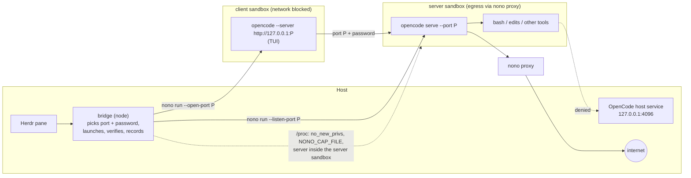

# Design

This page explains why the plugin is built the way it is. For the exact
commands and settings, see the [reference](../reference/actions.md).

## Why two sandboxes

OpenCode 2.x is a client and a server, and the server runs the model loop and
every tool call. Plain `opencode` talks to a background service on the host,
so the tools would run outside any sandbox even with the client inside one.
The plugin therefore starts a **private server per pane in its own sandbox**
and the **TUI client in a second sandbox**, joined by one localhost port it
picks and a password it generates for each launch:

- The server sandbox reaches the internet only through nono's proxy, so
  proxy-aware tools (`curl`, `git` over HTTPS, `npm`, `pip`, the model API)
  work, while direct TCP connects, including to services on localhost such as
  the OpenCode host service on `127.0.0.1:4096`, are denied.
- The client sandbox has no network at all except its server's port.
- Both block Herdr's control socket, the systemd and D-Bus sockets and the SSH
  and GPG agents.

After every launch the plugin checks from outside, by walking both sandboxes'
process trees, that every process is confined and that the server is the one
it started, and stops the agent when not.

[What the sandbox stops](security.md) has the evidence for each claim and the
reason a single sandbox does not work.

## Two plugin processes

Herdr runs plugin actions as short-lived child processes without a TTY and
caps their captured output at 64 KiB. Anything interactive therefore has to
move into a pane. The plugin is split accordingly:

- `src/action.mjs` is what Herdr spawns. It resolves the invocation context,
  talks to Herdr through `HERDR_BIN_PATH`, updates the mapping store, and
  prints the result marker line. It never blocks on a terminal.
- `src/bridge.mjs` is typed into a pane by `herdr pane run`. It checks the
  host (workspace, agent binary, OpenCode host service), starts `nono run`
  with the terminal inherited, verifies the session from outside while it
  starts, and records the exit.

The command typed into the pane is
`env HERDR_AGENT=<kind> <node> <bridge> start ...`. It starts with `env`
rather than the `KEY=VALUE cmd` prefix because fish does not support that
form.

## Start sequence

1. Pick the workspace root: the workspace's worktree checkout, else the
   workspace directory, else the git top level of the pane's directory, else
   that directory. The pane's directory only decides where the agent starts;
   `/` and the home directory are refused.
2. `nono --version` as a reachability probe. Fail before touching Herdr.
3. `herdr pane split <pane> --direction right --ratio 0.5 --cwd <workdir> --focus`.
4. Store a `provisional` mapping for the new pane id.
5. `herdr pane rename`, then `herdr pane run` with the bridge command.
6. Bridge: acknowledge on the mapping, check the host, stop server sessions
   of this mapping that outlived an earlier bridge, pick a free port `P` on
   the host and generate a password.
7. Start the server, detached from the pane's terminal, with its output in
   `logs/<session>-server.log`:
   `nono run --silent --profile <server profile> --name <session>-server --allow <root> --listen-port P -- opencode serve --hostname 127.0.0.1 --port P`,
   and poll `GET /api/info` with the password until it answers `200`.
8. Start the client in the pane:
   `nono run --profile <client profile> --name <session> --allow <root> --open-port P -- opencode --server http://127.0.0.1:P`,
   with `HERDR_*` and the socket variables removed and `OPENCODE_PASSWORD`
   set for both.
9. While it runs: verify both process trees every second until they pass or
   twenty seconds are up; record the report; toast and stop on failure.
10. On exit: stop the server (SIGTERM, SIGKILL after five seconds), restore
    the terminal, record `exited` (or `failed`) and the exit code, print how
    to resume.

## Which directory gets granted

The workspace's worktree checkout, or the workspace directory, or the git
repository containing the focused pane's directory, or that directory itself
when it is not inside a repository. That directory is passed to
`nono run --allow`; the pane's own directory only decides where the agent
starts. A grant must not change with every `cd` in the pane, so the plugin
never uses `--allow-cwd`, and it refuses your home directory and `/`, which
would undo the sandbox. Everything else the agent may touch comes from the
profile: the OpenCode pack grants OpenCode's own state and config
directories, the language toolchains and `/tmp`.

## Why these choices

- **A private server per pane, never the host service.** OpenCode's server
  executes the tools, so it must run in a sandbox the plugin started. The
  client's `--server http://127.0.0.1:<port>` is an adapter `requiredArgs`
  entry, so `agentArgs` cannot point it elsewhere, and the verification checks
  that a `serve --port <port>` process runs in the server sandbox.
- **Two sandboxes, not one.** The first release ran `opencode --standalone`
  (client and server in one sandbox, joined over stdio and an ephemeral
  port) with open egress. Open egress means open loopback, and the tools
  could reach the unsandboxed OpenCode host service. Every nono mode that
  closes loopback breaks standalone mode ([security](security.md#why-not-standalone-in-one-sandbox)), but the proxy
  mode accepts an explicit `--listen-port` and the blocked mode an explicit
  `--open-port`. So the server runs in proxy mode with every domain allowed
  (internet through the proxy, no direct connects), the client with no
  network, and the plugin owns the port and the password between them. The
  price is nono's rate limit on connection checks in proxy mode.
- **Shipped profiles on top of the pack.** The pack is the maintained
  description of what OpenCode needs. The plugin adds only what a Herdr pane
  needs on top (AF_UNIX mediation, environment stripping, no save prompt, the
  network mode of each side) and passes the profiles by path, so nothing is
  installed into `~/.config/nono/profiles`.
- **Verification from outside.** nono's own output says what it intended to
  apply; `/proc` says what the processes actually carry. Checking the tree
  also catches the one mistake that would silently undo the sandbox for
  OpenCode: a client that talks to a server outside it.
- **The server is detached from the pane.** It runs in its own process group,
  so `ctrl+c` in the TUI never reaches it; the bridge stops it when the client
  exits, `stop` stops one whose bridge died, and every launch first stops
  leftovers of the same mapping. The check runs from
  the bridge, outside the sandbox, so a compromised agent cannot fake it.
  Failing closed (`onVerificationFailure: "stop"`) is the default because a
  launch that fails verification is exactly the case the plugin exists to
  prevent.
- **An escape probe in `doctor`.** Profiles differ, packs update, and the
  Unix-socket gap is easy to reintroduce with a custom profile. Probing inside
  a real sandbox with the configured profile tests the thing that matters.
- **No persistent sandbox, no deletion popup.** A nono sandbox is a process.
  There is nothing to create ahead of time, stop without killing, or delete,
  so the Docker plugin's lifecycle states, popup pane, clone mode,
  `fetch-changes`, `open-port` and `replace-sandbox` have no counterpart.
  `reconnect` starts a new sandbox under the same name and policy and resumes
  the conversation with `--continue`.
- **`--allow <root>`, never `--allow-cwd`.** The pane's directory changes with
  every `cd`; the grant must be the directory the mapping recorded.
- **Captured nono calls time out** (30 seconds) so a wedged nono cannot hang
  an action. The interactive session has no timeout.
- **Ownership by process record.** The bridge and open shells record their
  pid plus start time on the mapping, verified by command line, so
  `reconnect`, `forget-mapping` and `prune-mappings` never act on a mapping
  whose agent runs, even when Herdr has not detected it yet.

## Borrowed from herdr-sbx-plugin

The action names, key bindings, result line, error-kind style, the node shim
and build step, the key binding installer, the per-pane state store with its
locks, the pane re-homing in `reconnect`, the overlay and the test approach
(real scripts against fake CLIs) come from
[herdr-sbx-plugin](https://github.com/dirien/herdr-sbx-plugin). What is new
is everything that depends on nono being a process sandbox: the launch, the
verification, the escape probe and the host service detection.
