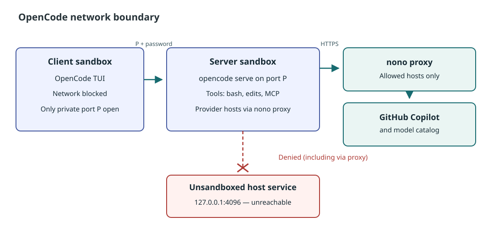

# Security

## Why OpenCode needs two sandboxes

OpenCode 2.x is a client and a server. The client is only the TUI; the
**server runs the model loop and every tool call** (`bash`, file edits, MCP
servers). Plain `opencode` connects to a background service on the host
(`127.0.0.1:4096`), so sandboxing only the TUI would leave every tool
unconfined.

The plugin therefore never lets the client use the host service. For each
pane it starts:

- a **private server** in a server sandbox:
  `opencode serve --hostname 127.0.0.1 --port P`;
- the **TUI** in a client sandbox: `opencode --server http://127.0.0.1:P`.

The plugin picks the port `P` and a fresh password (`OPENCODE_PASSWORD`) on
every launch; the server rejects requests without it. `--server` is a required
argument that configuration cannot replace.



## What each sandbox can reach

| | Server sandbox (server + tools) | Client sandbox (TUI) |
| --- | --- | --- |
| Files | The workspace root read-write, plus what the `nolabs-ai/opencode` pack grants (OpenCode's state and config, toolchains, `/tmp`) | Same |
| Internet | HTTP(S) through nono's proxy to the LLM provider's hosts (GitHub Copilot) and OpenCode's model catalog; every other host gets `403` | None |
| Localhost | Nothing, except accepting its client on `P`. The host service on `4096` is unreachable, directly and through the proxy | Only the server on `P` |
| SSH, databases, UDP | Denied (direct TCP and UDP are blocked) | Denied |
| Herdr's control socket, systemd, D-Bus, SSH and GPG agents, X11/Wayland | Denied | Denied |
| `HERDR_*`, `SSH_AUTH_SOCK`, `DBUS_SESSION_BUS_ADDRESS`, `TMUX` | Removed | Removed |

Herdr's socket matters most: through it a process can type commands into any
other pane, which run outside the sandbox. [Profiles](profiles.md) lists the
settings behind each row.

### Why `herdr pane run` cannot reach the host

`herdr pane run <pane> <cmd>`, `send-text`, `send-keys` and `split` are
requests to the Herdr server over its control socket,
`~/.config/herdr/herdr.sock` (or `$HERDR_SOCKET_PATH`). The server runs the
command in a real pane, outside any sandbox, so a sandboxed process that
reaches the socket can run anything on the host. Three layers stop it:

1. **No address.** nono drops `HERDR_*` (`environment.deny_vars`) and the
   plugin strips them too, so the sandbox gets no `HERDR_SOCKET_PATH` and no
   pane ids. This alone is not enough: the default path is well known.
2. **No connection.** `linux.af_unix_mediation: "pathname"` makes nono refuse
   `connect()` to any Unix socket the profile does not grant. Neither shipped
   profile grants Herdr's. The socket file is visible (`ls` works), but
   connecting fails with `EPERM`, and the `herdr` CLI fails with
   `Permission denied` before it sends anything.
3. **Checked.** `doctor` connects to the socket from a sandbox with the server
   profile (`herdrSocket`, critical) and fails if it gets through.

Verified with Herdr 0.9.1 and nono 0.78.0 by running inside each shipped
profile, with the socket path set by hand, against a pane id that does not
exist (an answer would prove access without running anything):

```bash
cd "$(mktemp -d)"
nono run --silent --profile "<plugin root>/profiles/herdr-opencode-server.json" --allow "$PWD" -- \
  sh -c 'HERDR_SOCKET_PATH=$HOME/.config/herdr/herdr.sock herdr pane run zz:p999 true'
# Error: Os { code: 1, kind: PermissionDenied, message: "Operation not permitted" }
```

The same command on the host, or under a copy of the profile without
`af_unix_mediation`, gets Herdr's answer
`{"error":{"code":"pane_not_found",...}}`: the server was reached, and a real
pane id would have run the command. So keep the mediation setting in every
profile you write ([Keep these settings](profiles.md#keep-these-settings)).
`test/integration-sandbox.test.mjs` runs this check, and the control without
mediation, whenever nono and a Herdr server are present.

## How it is checked

- **After every launch** the plugin walks both process trees from outside,
  through `/proc`, for up to twenty seconds. It requires that every process is
  confined (`no_new_privs` set, `NONO_CAP_FILE` present), that the server
  sandbox runs `opencode serve ... --port P`, that the client points at that
  port, and that no process holds a connection to the host service. If any
  check fails, the agent is stopped and marked `failed`
  (`onVerificationFailure: "stop"`). The result shows in the
  [overlay](overlay.md) and `info`.
- **On demand**: `verify-sandbox`, or `v` in the overlay, while a tool runs.
- **Before every launch** the plugin resolves the server profile with
  `nono profile show` and refuses to start (`unconfined`) when an allowed
  domain can reach localhost ([below](#why-egress-is-an-allowlist)), whether or
  not the host service runs at that moment.
- **`doctor`** starts a throwaway sandbox with the server profile and tries to
  reach Herdr's socket, systemd, D-Bus, Docker, the SSH and GPG agents,
  `~/.ssh`, your home directory and the host service port. It also listens on
  a random port of the host's `127.0.0.1` and tries that port directly and
  through nono's proxy as `127.0.0.1`, `localhost`, `0.0.0.0`, `127.1`,
  `[::1]` and `127.0.0.1.nip.io` (`loopbackCanary`, `loopbackViaProxy`). A
  critical success (Herdr, systemd, D-Bus, Docker, localhost) fails `doctor`
  with `unconfined`.

The checks run outside the sandbox, so the agent cannot fake them.

Two test files repeat them against the real nono (skipped without it, or with
`HERDR_NONO_INTEGRATION=0`), each with a control that removes the protection
and shows the test would catch it:

| File | Checks |
| --- | --- |
| `test/integration-egress.test.mjs` | No localhost from the server sandbox, directly or through the proxy under any loopback name; the host service port; Copilot hosts allowed, other hosts `403`; `"*"` and `localhost` refused before launch |
| `test/integration-sandbox.test.mjs` | No host Unix socket from either sandbox, even in a writable directory; `herdr pane run` fails in both; no `HERDR_*`, SSH, GPG, D-Bus or tmux variables; `doctor`'s probe passes for both profiles; workspace writable, home not; the client reaches only its server's port, the server listens only on it |

## What it does not protect

### The OpenCode host service

The host service's password sits in `~/.local/state/opencode/service.json`,
inside a directory OpenCode must be able to write, and nono cannot hide one
file in a granted directory. The agent can read it, but with the shipped
server profile it cannot reach the port, so the password is useless. With a
server profile that opens localhost, the plugin refuses to start agents while
the service runs, or while it could start (`hostServiceCheck: "refuse"`), and
`doctor` fails.

### Shared OpenCode config and state

Sandboxed and host OpenCode share sessions, auth and config. The pack grants
`~/.config/opencode` (and `~/.claude`, `~/.codex`) read-write, so the agent
can add a plugin or MCP server that a later **unsandboxed** OpenCode loads.
Review changes there before running OpenCode outside the plugin.

### The workspace

The agent writes your checkout, including `.git/hooks`, build scripts and CI
files. Anything you run from it on the host afterwards runs unconfined.

### Egress to the allowed hosts

The agent can send anything to the allowed hosts, your workspace included.
`github.com` and `api.github.com` serve more than Copilot (gists, issues, any
repository your token can write), so the allowlist limits where data can go
but does not stop exfiltration to GitHub.

## Why egress is an allowlist

In proxy mode nono denies direct connects, but its proxy forwards to **any
host the allowlist matches, localhost included**. With `allow_domain: ["*"]`,
the shipped value up to 0.1.0, a sandboxed process reached the host service on
`127.0.0.1:4096`, and any other loopback port, by sending
`CONNECT 127.0.0.1:4096` to the proxy. OpenCode's host service usually runs
(plain `opencode` restarts it), so the plugin cannot rely on it being stopped.

The proxy also does not check what an allowed name resolves to. Allowing
`localhost`, an IP address, a single-label host name, a `.local` or
`.internal` name, or a wildcard DNS name such as `127.0.0.1.nip.io` or
`*.localtest.me` opens localhost just like `"*"`. So:

- the shipped server profile allows only GitHub Copilot's hosts and OpenCode's
  model catalog ([Profiles](profiles.md#allowed-hosts));
- the plugin refuses to launch when the server profile allows any of the
  entries above (`hostServiceCheck: "refuse"`), `doctor` fails on them, and the
  overlay shows `+ LOCALHOST`;
- `nonoArgs` may not add network flags (`--allow-domain`, `--open-port`, ...)
  and the plugin drops the `NONO_*` variables nono reads as flags, such as
  `NONO_ALLOW_DOMAIN`, before it runs nono.

The remaining assumption: an allowed name never resolves to the host. That
holds for the providers' own domains; do not allow a wildcard under a domain
whose DNS records other people control.

`test/integration-egress.test.mjs` checks all of this against the real nono
(skipped when nono or the pack is missing).

## Known limitations

- **nono rate-limits connections in proxy mode.** With AF_UNIX mediation on,
  nono 0.78 denies connects beyond roughly ten in a burst. Downloads such as
  `npm install` slow down with retries, and a request can fail with "could not
  connect to proxy". Spacing requests by 0.1 s avoids it. The alternatives
  either reopen Herdr's socket or localhost, so this trade-off is deliberate.
- **Kernel 6.7+ (Landlock ABI v4)** is needed for the network rules. On older
  kernels run `doctor` and check `opencodeServicePort: denied` before relying
  on the localhost lockdown.
- **No clipboard**: X11 and Wayland sockets are blocked.

## Trusting the plugin

Installing a Herdr plugin runs its code as your user. This one runs only
its own binary, `nono`, `herdr`, `git` and `sh` (for the install and key binding
scripts), always as argument lists, never as shell strings built from repository
content. It never reads a secret (it reads the
host service's URL and pid, not its password) and grants nothing beyond the
workspace on top of the profile. Review
[`herdr-plugin.toml`](../herdr-plugin.toml), `scripts/` and `rust/src/` before installing.

The install step downloads `bin/herdr-nono` from the project's GitHub release
and checks its sha256 against the `SHA256SUMS` of the same release. That guards
against a damaged or truncated download, not against a compromised release. If
you need more, build from source (`HERDR_NONO_NO_BUILD` unset and no release for
your checkout, or `cargo build --release --locked`) after reading the code.

Tested on Linux 7.0 with nono 0.78.0, OpenCode 2.0.22, Herdr 0.9.1 and the
`nolabs-ai/opencode` pack 0.2.0. Results depend on the nono version and the
pack; `doctor` re-checks on your host.
