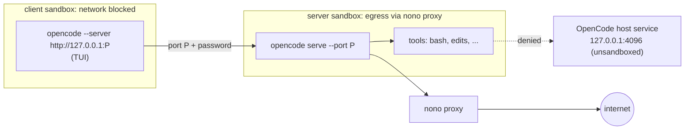

# Security

## Why OpenCode needs two sandboxes

OpenCode 2.x is a client and a server. The client is only the TUI; the
**server runs the model loop and every tool call** (`bash`, file edits, MCP
servers). Plain `opencode` connects to a background service on the host
(`127.0.0.1:4096`), so sandboxing only the TUI would leave every tool
unconfined.

The plugin therefore never lets the client use the host service. For each
pane it starts:

- a **private server** in a server sandbox:
  `opencode serve --hostname 127.0.0.1 --port P`;
- the **TUI** in a client sandbox: `opencode --server http://127.0.0.1:P`.

The plugin picks the port `P` and a fresh password (`OPENCODE_PASSWORD`) on
every launch; the server rejects requests without it. `--server` is a required
argument that configuration cannot replace.

## What each sandbox can reach

| | Server sandbox (server + tools) | Client sandbox (TUI) |
| --- | --- | --- |
| Files | The workspace root read-write, plus what the `nolabs-ai/opencode` pack grants (OpenCode's state and config, toolchains, `/tmp`) | Same |
| Internet | HTTP(S) through nono's proxy, any public host | None |
| Localhost | Nothing, except accepting its client on `P`. The host service on `4096` is unreachable, directly and through the proxy | Only the server on `P` |
| SSH, databases, UDP | Denied (direct TCP and UDP are blocked) | Denied |
| Herdr's control socket, systemd, D-Bus, SSH and GPG agents, X11/Wayland | Denied | Denied |
| `HERDR_*`, `SSH_AUTH_SOCK`, `DBUS_SESSION_BUS_ADDRESS`, `TMUX` | Removed | Removed |

Herdr's socket matters most: through it a process can type commands into any
other pane, which run outside the sandbox. [Profiles](profiles.md) lists the
settings behind each row.

## How it is checked

- **After every launch** the plugin walks both process trees from outside,
  through `/proc`, for up to twenty seconds. It requires that every process is
  confined (`no_new_privs` set, `NONO_CAP_FILE` present), that the server
  sandbox runs `opencode serve ... --port P`, that the client points at that
  port, and that no process holds a connection to the host service. If any
  check fails, the agent is stopped and marked `failed`
  (`onVerificationFailure: "stop"`). The result shows in the
  [overlay](overlay.md) and `info`.
- **On demand**: `verify-sandbox`, or `v` in the overlay, while a tool runs.
- **`doctor`** starts a throwaway sandbox with the server profile and tries to
  reach Herdr's socket, systemd, D-Bus, Docker, the SSH and GPG agents,
  `~/.ssh`, your home directory and the host service port. A critical success
  (Herdr, systemd, D-Bus, Docker, the host service) fails `doctor` with
  `unconfined`.

The checks run outside the sandbox, so the agent cannot fake them.

## What it does not protect

### The OpenCode host service

The host service's password sits in `~/.local/state/opencode/service.json`,
inside a directory OpenCode must be able to write, and nono cannot hide one
file in a granted directory. The agent can read it, but with the shipped
server profile it cannot reach the port, so the password is useless. With a
server profile that opens localhost, the plugin refuses to start agents while
the service runs (`hostServiceCheck: "refuse"`), and `doctor` fails.

### Shared OpenCode config and state

Sandboxed and host OpenCode share sessions, auth and config. The pack grants
`~/.config/opencode` (and `~/.claude`, `~/.codex`) read-write, so the agent
can add a plugin or MCP server that a later **unsandboxed** OpenCode loads.
Review changes there before running OpenCode outside the plugin.

### The workspace

The agent writes your checkout, including `.git/hooks`, build scripts and CI
files. Anything you run from it on the host afterwards runs unconfined.

### Egress

Every public host is reachable through the proxy. To narrow it, set a domain
list in the server profile ([Profiles](profiles.md#common-changes)).

## Known limitations

- **nono rate-limits connections in proxy mode.** With AF_UNIX mediation on,
  nono 0.78 denies connects beyond roughly ten in a burst. Downloads such as
  `npm install` slow down with retries, and a request can fail with "could not
  connect to proxy". Spacing requests by 0.1 s avoids it. The alternatives
  either reopen Herdr's socket or localhost, so this trade-off is deliberate.
- **Kernel 6.7+ (Landlock ABI v4)** is needed for the network rules. On older
  kernels run `doctor` and check `opencodeServicePort: denied` before relying
  on the localhost lockdown.
- **No clipboard**: X11 and Wayland sockets are blocked.

## Trusting the plugin

Installing a Herdr plugin runs its code as your user. This one runs only
`node`, `nono`, `herdr` and `git`, always as argument lists, never as shell
strings built from repository content. It never reads a secret (it reads the
host service's URL and pid, not its password) and grants nothing beyond the
workspace on top of the profile. Review
[`herdr-plugin.toml`](../herdr-plugin.toml) and `src/` before installing.

Tested on Linux 7.0 with nono 0.78.0, OpenCode 2.0.20, Herdr 0.9.1 and the
`nolabs-ai/opencode` pack 0.2.0. Results depend on the nono version and the
pack; `doctor` re-checks on your host.
